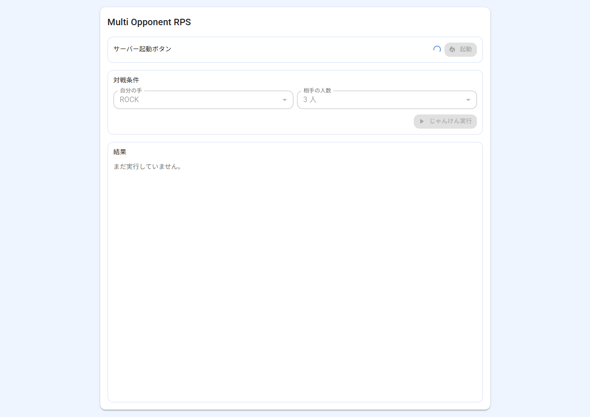
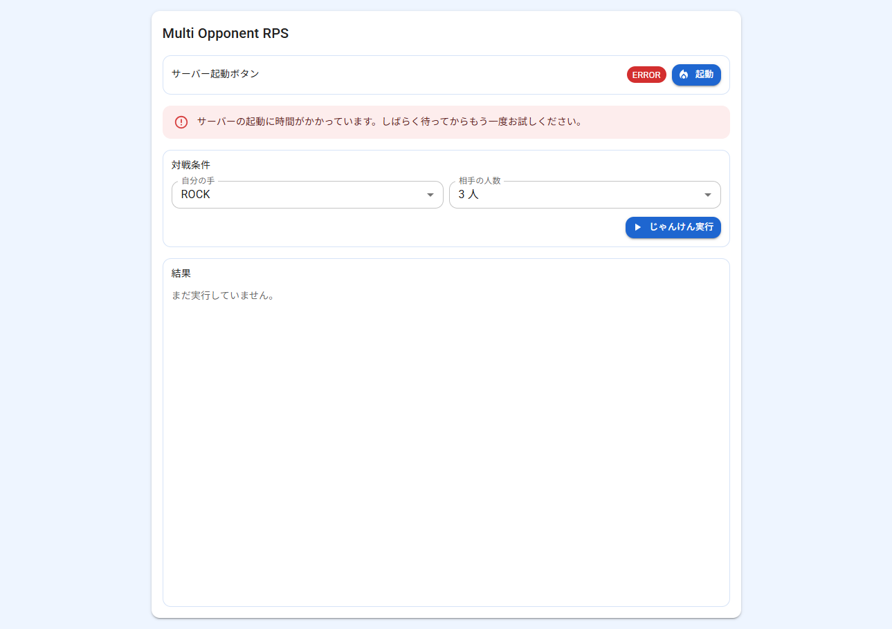
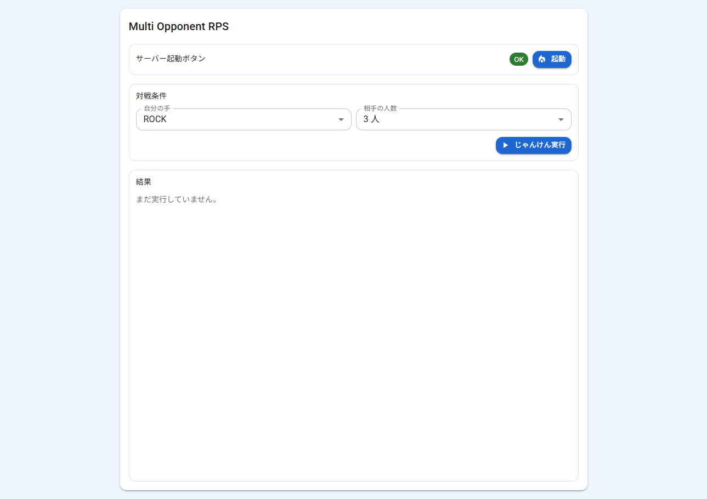
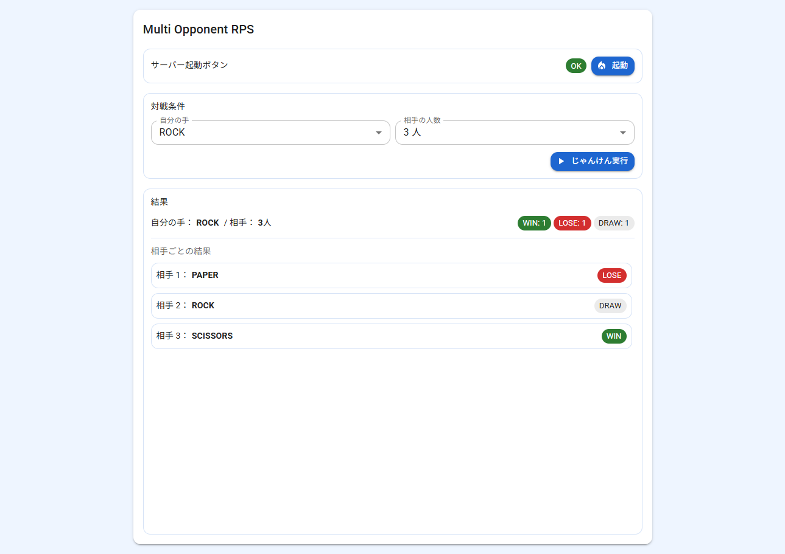
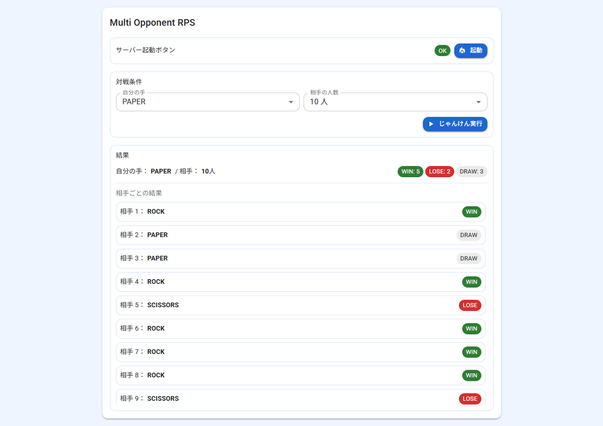
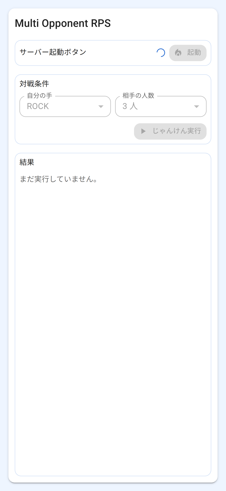
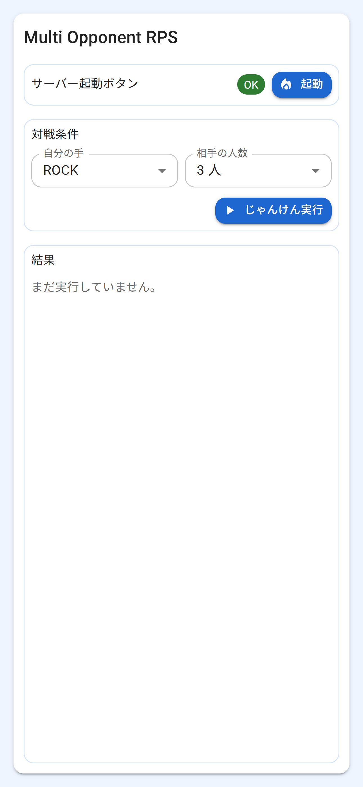
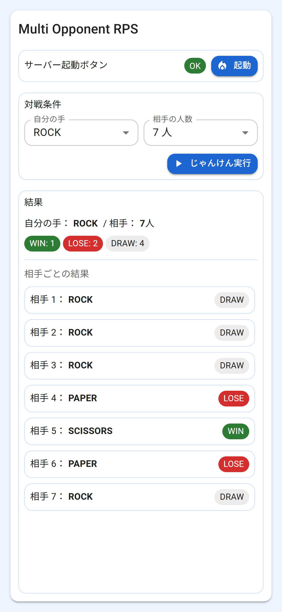

# Multi Opponent RPS

<p>
  <a href="https://multi-opponent-rps.vercel.app/">
    
  </a>
</p>

<p>
  
  
  
  
  
  
</p>

<p>
  
  
  
  
  
  
  
</p>

指定した人数（1〜10）の相手（CPU）と、まとめてじゃんけんを行うミニアプリ。  
バックエンドは Spring Boot の REST API、フロントは React + TypeScript（Vite）で実装（別ホスティング）。

- バックエンド：Render（Dockerfile でデプロイ）
- フロントエンド：Vercel（Vite ビルド成果物をデプロイ）
- DB：使用なし（ステートレス）

---

## デモ

[](https://multi-opponent-rps.vercel.app/)

- [`アプリURL`](https://multi-opponent-rps.vercel.app/)（Vercel）：`https://multi-opponent-rps.vercel.app/`

---

## スクリーンショット

1. サーバー起動確認中
   

2. サーバー起動失敗
   

3. サーバー起動成功
   

4. じゃんけん実行結果
   

5. じゃんけん実行結果（相手 10 人）
   

6. スマホ画面
<table>
  <tr>
    <td align="center">
      <a href="./docs/screenshots/06_smartphone-1.png">
        
      </a>
    </td>
    <td align="center">
      <a href="./docs/screenshots/07_smartphone-2.png">
        
      </a>
    </td>
    <td align="center">
      <a href="./docs/screenshots/08_smartphone-3.png">
        
      </a>
    </td>
  </tr>
</table>

---

## できること

- `/api/health` によるサーバー起動確認（Render のコールドスタート対策）
  - 画面初回表示で自動 warmup（`/api/health` を呼び出し）
- 自分の手（ROCK / PAPER / SCISSORS）と相手人数（1〜10）を選んで `/api/rps` を実行
- 相手ごとの結果（WIN / LOSE / DRAW）を一覧表示
- 勝敗集計を表示
- 1 画面完結 UI（結果一覧のみスクロール）

---

## この開発を通した学習目的

手順を一通り踏むことを優先し、実装 → 接続 → デプロイを最短で経験することを目的とした。

- Spring Boot で REST API を実装
- MUI をベースにして Tailwind を補助として使う
- フロント（Vite/React/TS）とバック（Spring Boot）の疎結合な連携（別オリジン前提）
- Dockerfile を用いたバックエンドのコンテナ化
- Vitest によるフロントのユニットテスト導入

---

## 前提条件

- Java 21（バックエンド）
- Node.js（フロントエンド）
- pnpm（`frontend/` は pnpm 前提）

---

## クイックスタート

### 1) バックエンド起動

```bash
cd backend
./gradlew bootRun
```

- 既定：`http://localhost:8080`

### 2) フロントエンド起動

```bash
cd frontend
pnpm install
pnpm dev
```

- 既定：`http://localhost:5173`

---

## 環境変数

### フロント（Vite）

- `VITE_API_BASE_URL`
  - ローカル例：`http://localhost:8080`
  - 本番例：Render の API URL

例：`VITE_API_BASE_URL=http://localhost:8080`

### バックエンド（Spring Boot）

- `ALLOWED_ORIGINS`
  - 許可するフロントのオリジン（例：Vercel の URL）
  - ローカル開発では `http://localhost:5173` を含める想定

例：`ALLOWED_ORIGINS=http://localhost:5173,https://<YOUR_VERCEL_APP>.vercel.app`

---

## テスト

### フロント（Vitest）

```bash
cd frontend
pnpm test
```

### バック（JUnit）

```bash
cd backend
./gradlew test
```

---

## ディレクトリ構成（概要）

```bash
.
├─ backend/      # Spring Boot API
├─ frontend/     # Vite + React UI
└─ docs/         # 仕様・設計など
```

---

## デプロイ（概要）

### バックエンド（Render）

- Dockerfile でビルドして起動
- 環境変数に `ALLOWED_ORIGINS` を設定（Vercel の URL を許可）

### フロント（Vercel）

- `VITE_API_BASE_URL` を Render の URL に設定してデプロイ

---

## 技術スタック

### Backend

- Java 21
- Spring Boot（REST API）
- Gradle
- JUnit

### Frontend

- TypeScript
- React
- Vite
- Material UI（MUI）
- Tailwind CSS

### Test

- JUnit（バックエンドのテスト）
- Vitest（フロントのユニットテスト）

### Deploy

- Render（バックエンド：Dockerfile デプロイ）
- Vercel（フロントエンド：SPA デプロイ）

---

## ドキュメント

ドキュメントは `/docs` にまとめています。

- 仕様/機能：[`docs/01_spec-summary.md`](docs/01_spec-summary.md)
- 設計：[`docs/02_architecture.md`](docs/02_architecture.md)
